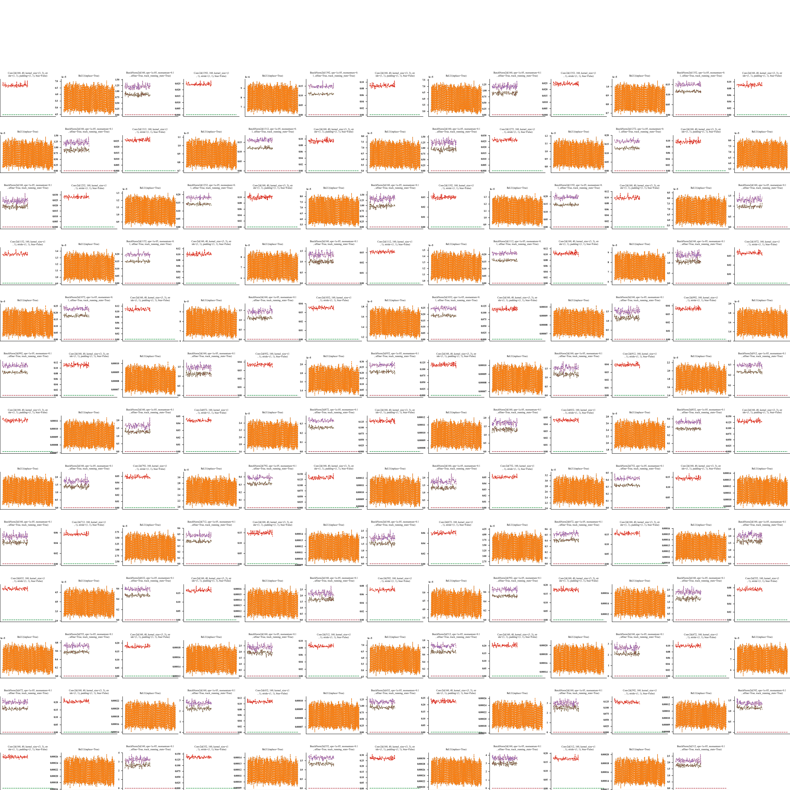

## Deep learning related image drawing

**这里陈列了我编写的一些关于深度学习的画图工具，如果觉得有帮助可以给个star.**

### plotlydict API

**我在其中加入了2维直方图，雷达图，条形图，柱状图，散点图，流形图，3维图，饼图，表格，热点图**

install:

```bash
vim ~/.bashrc
export PATH={root of plotlydict}:$PATH
source ~/.bashrc
```

**相关具体用法则在`API/example.py`下，你可以仿造进行编辑**

### PltHook

**该工具是用于检测模型训练时参数与其对应梯度的权重变化，能够帮助我们快速地定位问题所在.**

该工具的使用非常容易，首先你需要在py文件中导入该包，然后进行初始化（这里不建议初始化中填充的模型过于庞大，你可以仅仅调用模型的一部分进行可视化），最后在你想要show的代码位置show便可.


```python
import PltHook
import torch
import torch.nn as nn
import torch.nn.functional as F
model:nn.Module = Model() # your model

plt_hook=PltHook.PltAboutHook(model) # TODO: 1

... # A series of codes involving initialization work

for i,(image, label) in enumerate(dataloader):
    output=model(image)
    loss=criticion(output,label)
    loss.backward()
    plt_hook.show() # TODO: 2
```

相关细节可以查看代码中的reference介绍，呈现的结果如下:

#### mode=multi



#### mode=one


### Loss Landscape

该工具同样便于使用，最小呈现代码如下：

```python
import LossLandscape
import torch
import torch.nn as nn
import torch.nn.functional as F
from torch.utils.data import Dataset
model:nn.Module = Model() # your model
model.load_state_dict(torch.load("/you/path/to/pth"))
dataset:Dataset=TrainDataset()
criticion = lambda x,y:nn.CrossEntropyLoss()(x,y)
weight_decay=1e-4
loss_landscape=LossLandscape.LossLandscape(model=model,trainset=dataset,criticion=criticion) # TODO: 1
loss_landscape.draw() # TODO: 2
```

相关细节可以查看代码中的reference介绍，呈现的结果如下:


#### TSNE

该函数只要导入并调用即可，不过目前固定颜色只支持10个类别，如果需要更多类别你需要删去其中与颜色相关的部分

#### 1

```python
import TSNE
import torch.nn as nn
from torch.utils.data import DataLoader
dataloader:DataLoader = ... # init dataloader 
model:nn.Module = ... # init model
dataloader=iter(dataloader)
X,y=next(dataloader)
X,y=model(X),y
TSNE.T_SNE(X,y,if_save_image=True)
```

#### 2
```python
import torch
import torch.nn as nn
import torch.nn.functional as F

A=torch.randn(1000,20)*0.01+0.01

B=torch.randn(1000,20)*0.02-0.2

C=torch.randn(1000,20)*2 + 2

D=torch.cat([A,B,C],0)

from TSNE import T_SNE

T_SNE(D,torch.arange(3).unsqueeze(-1).repeat(1,1000).view(-1))
```
相关细节可以查看代码中的reference介绍，呈现的结果如下:


